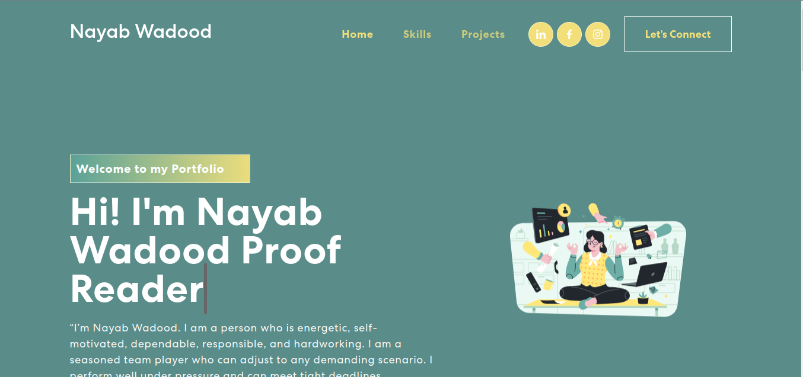

# Personal Portfolio Nayab Wadood

git clone

## 👨‍💻 Technologies Used

- React JS
- React-Icons
- SCSS
- React Carousel
- React Slider
- React-Bootstrap
- Firebase
- React-Router-Dom

## Features

- Lightweighted
- Social media links
- Attractive color palette.
- Dark Mode
- Random replies for hi, bye, and Stay Strong.

  

## 💖 Support

You can show your support by starring this project. ★

## 💡 Contribute

Let's contribute, to make some awesome stuffs

## 📄 License

[MIT](https://github.com/arifszn/gitprofile/blob/main/LICENSE)
